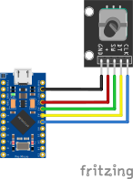
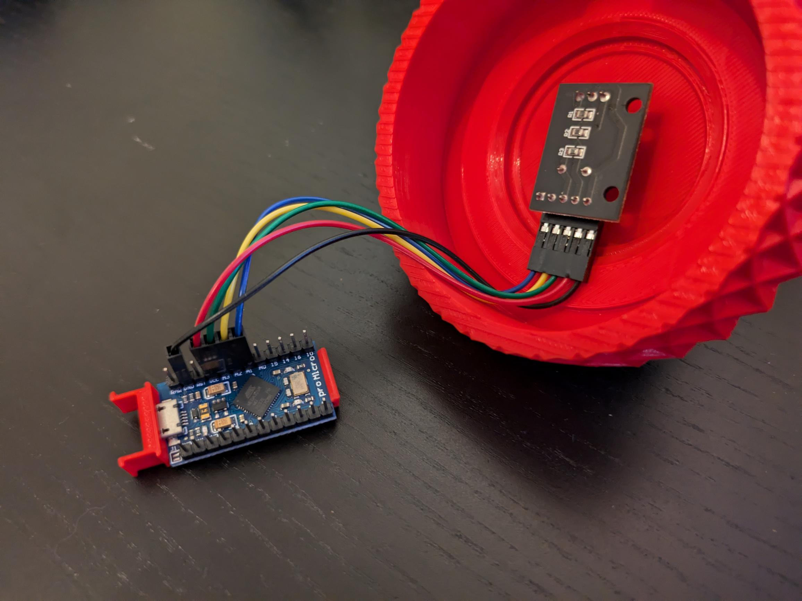

# HIDRotaryEncoder
Code for an Arduino Pro Micro to use a rotaty encoder as a HID device.

Made for [Prusa's Oversized Volume Knob](https://blog.prusa3d.com/3d-print-an-oversized-media-control-volume-knob-arduino-basics_30184/), but should work with pretty much any rotary encoder connected to an Arduino with HID support.

## Features
- Seperate actions for rotating with and without the button held
- Seperate actions for clicking, double clicking and holding the button
- Acceleration increases the response per click when spinning faster
- Handles encoders with multiple steps per click 

## Default mapping
- Rotation without holding changes volume
- Rotating while holding steps frame-by-frame in a paused YouTube video
- Clicking pauses media, double-clicking skips media, holding returns to previous media

## Wiring diagram
Note that the pins used are slightly different from Prusa's design, this can be easily changed in the code.

| Arduino | Rotary Encoder |
|--------:|:---------------|
|     GND | GND            |
|     VCC | +              |
|      A3 | SW             |
|      A2 | DT             |
|      A1 | CLK            |

Wiring diagram created using [Fritzing](https://fritzing.org/).

##

Read more about this project on my website: [https://marro.dev/blog/media-control-volume-knob](https://marro.dev/blog/media-control-volume-knob)